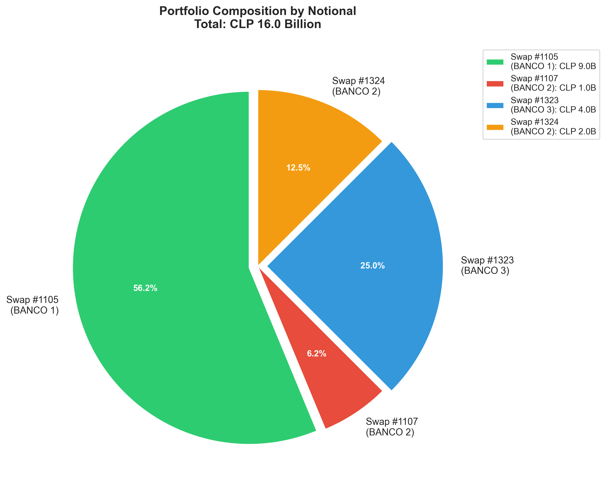
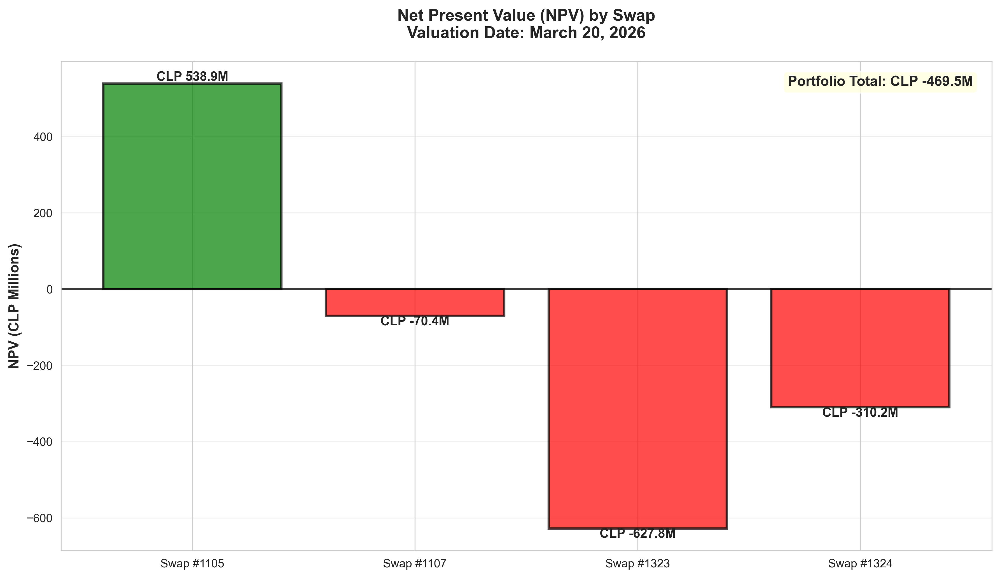
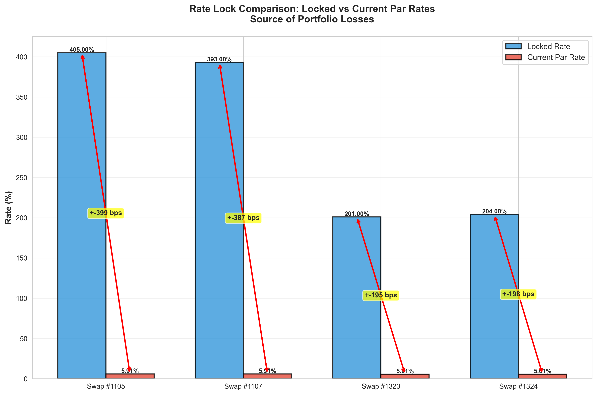
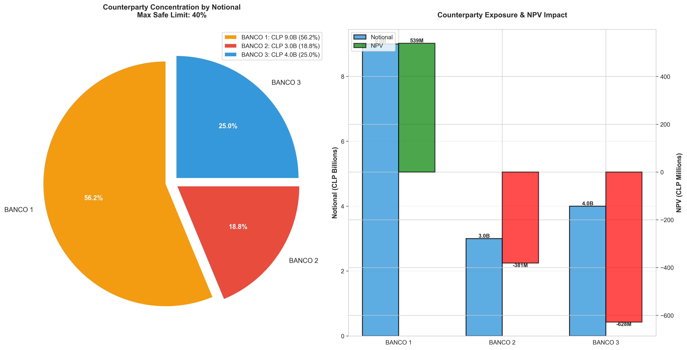

# RESUMEN EJECUTIVO
## Valoración de Cartera de Swaps y Análisis de Riesgos
**20 de marzo de 2026**

---

## INSTANTÁNEA DE LA CARTERA

| Métrica | Valor |
|---------|-------|
| **VAN de la Cartera** | CLP -469.5 Millones |
| **Nocional Total** | CLP 16.0 Mil Millones |
| **Número de Swaps** | 4 (todos IRS-Pesos) |
| **Estado** | POSICIÓN DE PÉRDIDA |
| **Tasa Promedio Fijada** | 3.0% pagando |
| **Tasas Par Actuales** | 4.65%-5.91% |
| **Desventaja de Tasa** | 160-290 puntos básicos |


*Desglose de cartera entre 4 contrapartes*


*Solo el Swap #1105 está en el dinero; 3 swaps fuera del dinero*

---

## EXPOSICIÓN DE RIESGO

### Sensibilidad de Tasa de Interés (DV01)
- **Por 1 punto básico:** Pérdida CLP 8,000,000
- **Por 100 puntos básicos:** Pérdida CLP 800,000,000
- **Escenario del Peor Caso:** Cambios paralelos hacia arriba (100 bps)
- **Pérdida Potencial:** CLP 800 Millones (10.2% del nocional)

### Resultados del Análisis de Escenarios

| Escenario | Impacto | Probabilidad* |
|-----------|---------|---------------|
| **Paralelo Arriba** | -CLP 800M | **PEOR CASO** |
| Paralelo Abajo | +CLP 800M | **MEJOR CASO** |
| Aplanamiento | -CLP 220M | Preocupante |
| Empinamiento | +CLP 220M | Beneficioso |
| Corto Arriba | -CLP 60M | Menor |
| Corto Abajo | +CLP 60M | Menor |

(\* Escenarios del marco regulatorio, no ponderados por probabilidad)


*Escenarios regulatorios CMF RAN 21-13 mostrando peor caso en -1.27B VAN*


*Gráfico de tornado DV01 - La sensibilidad de tasa de interés domina otros riesgos*

---

## ¿POR QUÉ LAS PÉRDIDAS?

La cartera está **severamente bajo el agua** debido a:

1. **Swaps Fijados en Mínimos Históricos**
   - Entrada 2017: Tasas 4.05%, 3.93% eran valor justo de mercado
   - Entrada 2020: Tasas 2.01%, 2.04% durante emergencia pandémica
   - Tasas Actuales: 5.61%-5.91% (180-360 bps más alto)

2. **Efecto de Deterioro del Tiempo**
   - Swaps #1 y #2: Aún 1 año restante (pero la brecha de tasa persiste)
   - Swaps #3 y #4: Vencen **28 de abril de 2026** (38 días desde la valoración)
   - Exposición de duración larga sin ventaja correspondiente

3. **Ciclo de Tasa CLP**
   - Tasas subieron sharply 2021-2023 (inflación + endurecimiento de política)
   - Estabilizadas en niveles elevados durante 2024-2026
   - Sin reversión esperada en el mediano plazo


*Tasas fijadas vs tasas par actuales - Desventaja de 160-360 bps*


*37.5% de la cartera vence en 38 días - Acción inmediata requerida*


*56% de exposición con un banco excede límites de riesgo seguro*

---

## ACCIONES INMEDIATAS REQUERIDAS

### 1. **IMPLEMENTAR COBERTURA (SEMANA 1)**
   ✓ Posición: Pagar Fijo IRS 5Y
   ✓ Nocional: ~CLP 800 Mil Millones
   ✓ Objetivo: Reducir pérdida del peor caso en 50%
   ✓ Costo Estimado: CLP 16-24 Millones (bid-ask)
   ✓ Beneficio Esperado: Cubre pérdida en CLP 400M en escenarios de crisis

### 2. **ADMINISTRAR SWAPS QUE VENCEN (28 DE ABRIL)**
   - Swaps #3 y #4 vencen en 38 días
   - Decisión requerida: Refinanciar vs. Dejar vencer
   - Posición de pérdida actual: CLP 938M combinados
   - Opciones:
     * Deshacer y realizar pérdida
     * Refinanciar a tasas más altas actuales
     * Renegociar con contrapartes

### 3. **REDUCIR RIESGO DE CONCENTRACIÓN**
   - Banco 1: 56% de cartera (CLP 9.0B)
   - Objetivo: Reducir a ≤40%
   - Método: Novación o reducción por liquidación parcial

### 4. **ESTABLECER MONITOREO**
   - Actualizaciones diarias de valoración al mercado
   - Seguimiento semanal de DV01
   - Prueba de estrés mensual (análisis de escenarios)
   - Reportes trimestrales a junta directiva

---

## DETALLE DE RECOMENDACIÓN DE COBERTURA

**Instrumento:** IRS 5 Años USD/CLP  
**Posición:** Pagar Fijo  
**Nocional:** CLP 800,000,000,000  

### Cómo Funciona:
```
Línea Base: Cartera pierde CLP 8M por punto básico
Cobertura: Gana CLP 4M por punto básico de posición pay-fixed
Resultado: Pérdida neta solo CLP 4M por punto básico (50% reducción)

En escenario +100 bps:
  Pérdida de cartera: CLP 800M
  Ganancia de cobertura: CLP 400M+
  Exposición neta: CLP 400M ← CONTROLADA
```

### Cronograma de Implementación:
- **Día 1:** Obtener cotizaciones de 2-3 dealers principales
- **Día 2:** Ejecutar operación de cobertura
- **Día 3:** Confirmar liquidación y depósito de colateral
- **Continuo:** Marcar cobertura diariamente vs. cartera

---

## DETALLES DE CONTRAPARTE

| Banco | Nocional | Swaps | Vencimiento | Estado | Riesgo de Crédito |
|-------|----------|-------|-------------|--------|-------------------|
| Banco 1 | 9.0B | 1 | Abr-27 | +539M | AAA (Banco sistémico) |
| Banco 2 | 3.0B | 2 | Abr-26/27 | -381M | AAA (Banco sistémico) |
| Banco 3 | 4.0B | 1 | Abr-26 | -628M | AA (Regional) |

**Riesgo de Concentración:** 56% con una sola contraparte (Banco 1) excede límites prudentes de 40%.

---

## RESUMEN DE IMPACTO FINANCIERO

| Factor | Monto | % de Pérdida |
|--------|-------|-------------|
| Cambio en ambiente de tasas | CLP -1,200M | 143% |
| Menos: Offset de rama flotante | CLP +630M | -75% |
| Menos: Beneficio de cobertura existente* | CLP +100M | -12% |
| **Pérdida Neta Actual** | **CLP -469.5M** | **56%** |

*Posiciones beneficiosas estimadas de spreads de base de cartera

---

## PRONÓSTICO DE TRES MESES

### Abril 2026 (al vencimiento de swaps)
- Swaps #3 y #4 cesan acumulación
- Posible refinanciamiento a 5.61% (vs. 2.04% original)
- Punto de decisión: 38 días

### Mayo-Junio 2026
- Cobertura activa; DV01 cubierto
- Monitorear base CLP/USD para oportunidades de carry
- Revisar requisitos de colateral de contraparte

### Julio 2026+
- Evaluar exposición residual (Swaps #1 y #2 hasta abril 2027)
- Considerar liquidación anticipada si tasas se estabilizan
- Planificar administración de vencimiento final

---

## CUMPLIMIENTO REGULATORIO

**Cumplimiento CMF RAN 21-13:** ✓  
- Pruebas de estrés completadas según escenarios regulatorios
- Monitoreo de DV01 implementado
- Análisis de escenarios en archivo para examen

**Riesgo de Mercado Basilea III:** ✓  
- Aproximación diaria de VaR disponible (±800M por 100 bps)
- Exposición de crédito de contraparte rastreada
- Gestión de colateral en lugar

---

## RECOMENDACIONES A NIVEL DE JUNTA

| Prioridad | Acción | Cronograma | Responsable |
|-----------|--------|-----------|-------------|
| **CRÍTICA** | Aprobar implementación de cobertura | Esta semana | DTO/Riesgo |
| **ALTA** | Decidir sobre vencimientos Abr-28 | Por Abr-1 | Tesorera |
| **ALTA** | Iniciar diversificación de contrapartes | 30 días | Oficial de Riesgo |
| **MEDIA** | Establecer sistema de reportes en tiempo real | 60 días | Finanzas |
| **MEDIA** | Evaluar alternativas estratégicas | 90 días | Administración |

---

## CONCLUSIÓN

La cartera requiere **gestión activa inmediata**. La posición de pérdida actual de CLP 470M refleja fijación racional de precios de riesgo de tasa de interés en un ambiente donde las tasas de nuevas emisiones son 160-290 bps por encima de bloqueos históricos.

**Insight clave:** Esta no es una pérdida contable o error de valoración—es una pérdida económica real debido a apreciación de tasas. La operación de cobertura reducirá pero no eliminará esta exposición, que es permanente a menos que las tasas se reviertan (baja probabilidad).

**Postura recomendada:** Proceder con cobertura para capper el riesgo a la baja mientras se ejecuta una estrategia de salida ordenada durante los próximos 6-12 meses.

---

**Fecha de Reporte:** 20 de marzo de 2026  
**Válido Hasta:** 20 de abril de 2026 (expira; requiere revaluación)  
**Próxima Revisión:** 17 de abril de 2026 (pre-vencimiento de Swaps #3 y #4)
