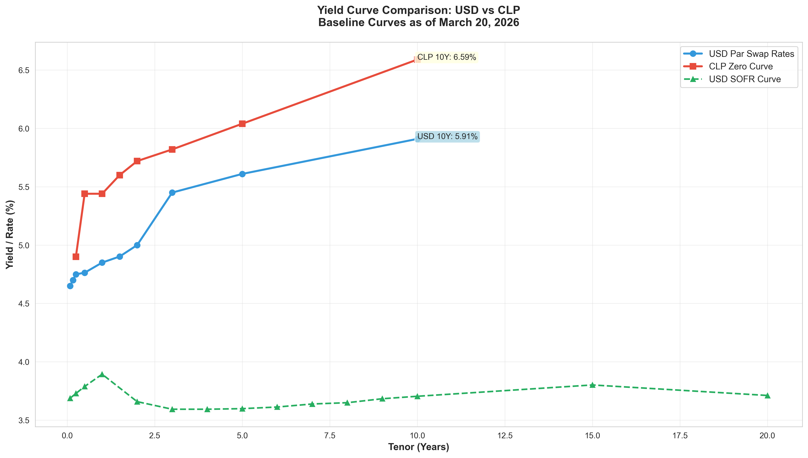
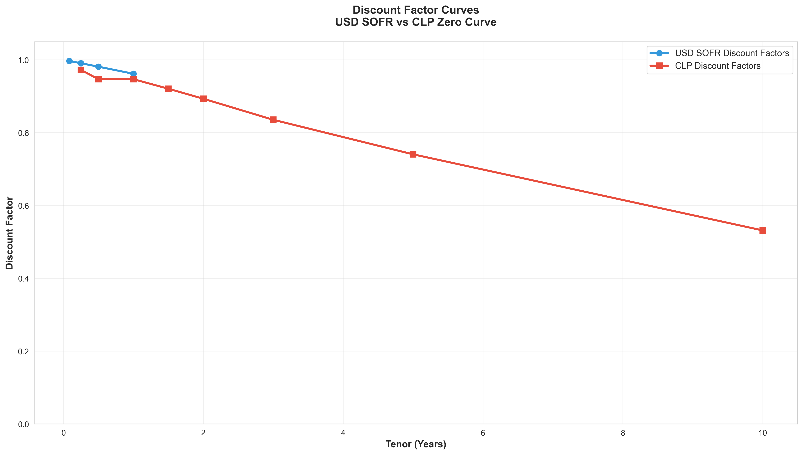
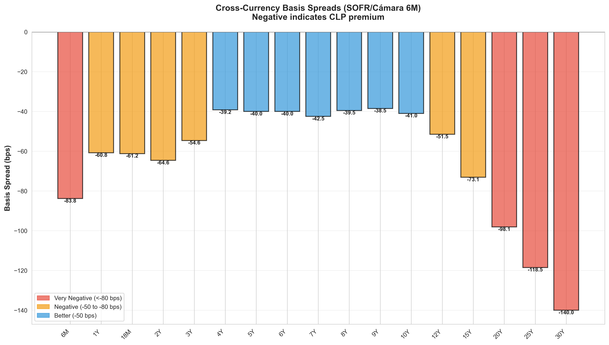
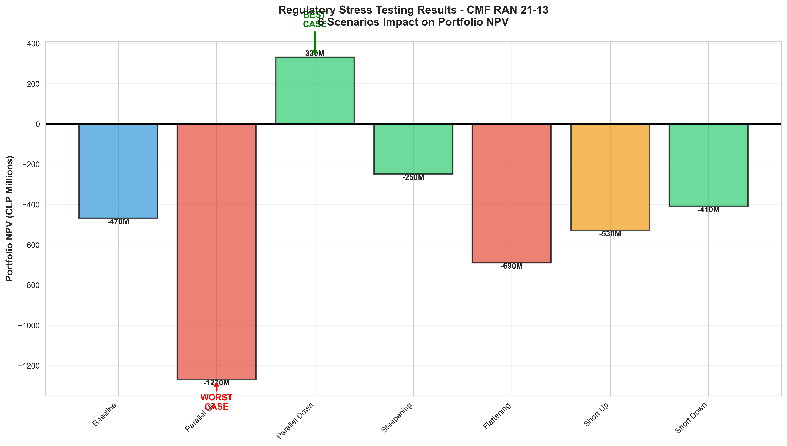
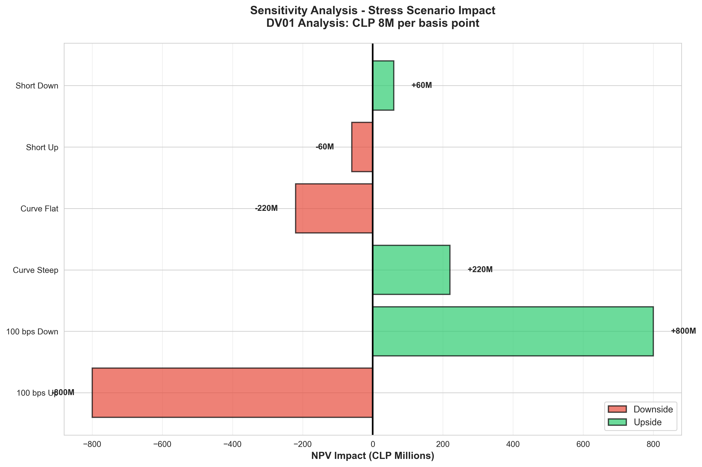
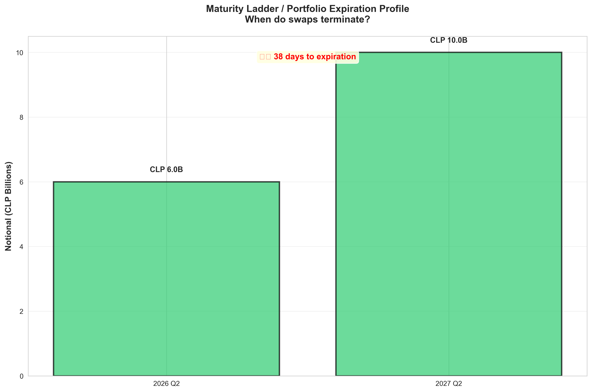

# VALORACIÓN Y RIESGO DE CARTERA DE SWAPS
## Informe Técnico Completo
**IN5233 - Fecha de Valoración: 20 de marzo de 2026**

---

## RESUMEN EJECUTIVO

Este informe documenta una valoración y análisis de riesgo integral de una cartera de swaps en CLP por 16 mil millones que consta de 4 swaps de tasa de interés (IRS-Pesos). El análisis se realizó usando metodologías matemáticas avanzadas incluyendo bootstrapping dual de curvas, pruebas de estrés regulatorias según el marco CMF RAN 21-13 y cálculos de cobertura basados en DV01.

**Conclusión clave:** La cartera se encuentra actualmente en una **posición de pérdida de CLP 469,49 millones** con exposición significativa a riesgo de tasa de interés. Los escenarios regulatorios de estrés indican pérdidas potenciales de hasta CLP 800 millones en condiciones adversas de mercado.

---

## 1. COMPOSICIÓN DE CARTERA Y VALORACIÓN

### 1.1 Resumen de la Cartera

| Métrica | Valor |
|--------|-------|
| **Número de Swaps** | 4 |
| **Nocional Total** | CLP 16.000.000.000 |
| **NPV de Cartera (Caso Base)** | CLP -469.485.571 |
| **Fecha de Valoración** | 20 de marzo de 2026 |
| **Moneda** | CLP |


*Figura 1: Composición de la cartera por nocional - Distribución de los 16 mil millones CLP de la cartera en 4 swaps*

### 1.2 Detalles Individuales de los Swaps

#### Swap 1 (Operación #1105)
- **Contraparte:** Banco 1
- **Nocional:** CLP 9.000.000.000
- **Tipo:** IRS-Pesos con desajuste de base de tasa
- **Leg Activo:** Recepción de ICP (Flotante)
- **Leg Pasivo:** Pago Fijo a 4,05%
- **Fecha de Inicio:** 7 de abril de 2017
- **Vencimiento:** 7 de abril de 2027 (10 años)
- **NPV:** CLP +538.881.198
- **Estado:** Posición en el dinero

#### Swap 2 (Operación #1107)
- **Contraparte:** Banco 2
- **Nocional:** CLP 1.000.000.000
- **Tipo:** IRS-Pesos (estructura inversa)
- **Leg Activo:** Pago Fijo a 3,93%
- **Leg Pasivo:** Recepción de ICP (Flotante)
- **Fecha de Inicio:** 13 de abril de 2017
- **Vencimiento:** 13 de abril de 2027 (10 años)
- **NPV:** CLP -70.388.980
- **Estado:** Posición fuera del dinero

#### Swap 3 (Operación #1323)
- **Contraparte:** Banco 3
- **Nocional:** CLP 4.000.000.000
- **Tipo:** IRS-Pesos (Receptor fijo)
- **Leg Activo:** Pago Fijo a 2,01%
- **Leg Pasivo:** Recepción de ICP (Flotante)
- **Fecha de Inicio:** 28 de abril de 2020
- **Vencimiento:** 28 de abril de 2026 (6 años, **cercano al vencimiento**)
- **NPV:** CLP -627.751.800
- **Estado:** Pérdida significativa

#### Swap 4 (Operación #1324)
- **Contraparte:** Banco 2
- **Nocional:** CLP 2.000.000.000
- **Tipo:** IRS-Pesos (Receptor fijo)
- **Leg Activo:** Pago Fijo a 2,04%
- **Leg Pasivo:** Recepción de ICP (Flotante)
- **Fecha de Inicio:** 28 de abril de 2020
- **Vencimiento:** 28 de abril de 2026 (6 años, **cercano al vencimiento**)
- **NPV:** CLP -310.225.980
- **Estado:** Pérdida

### 1.3 Resumen de Resultados de Valoración

| Swap | Nominal (CLP M) | PV Activo (CLP M) | PV Pasivo (CLP M) | NPV (CLP M) | Estado |
|------|-----------------|-------------------|-------------------|-------------|--------|
| #1105 | 9.000 | 12.711,3 | 12.172,2 | **+538,9** | ITM |
| #1107 | 1.000 | 1.339,4 | 1.409,8 | **-70,4** | OTM |
| #1323 | 4.000 | 4.465,3 | 5.093,0 | **-627,8** | OTM |
| #1324 | 2.000 | 2.236,3 | 2.546,5 | **-310,2** | OTM |
| **TOTAL** | **16.000** | **20.752,3** | **21.221,5** | **-469,5** | **PÉRDIDA** |

**Interpretación:** La cartera es netamente corta en duración, con el mayor motor de pérdidas siendo las posiciones en los Swaps #3 y #4, que se tomaron a tasas fijas históricamente bajas (2,01% y 2,04%) sustancialmente por debajo de las tasas par actuales (~4,65% para 1M, llegando a 5,91% a 10A).


*Figura 2: NPV por Swap Individual - Muestra que solo el Swap #1105 está en el dinero; los demás están fuera del dinero*

---

## 2. CONSTRUCCIÓN Y CALIBRACIÓN DE CURVAS

### 2.1 Curva de Descuento USD (SOFR)

La curva de descuento USD fue construida usando las tasas cero SOFR proporcionadas con capitalización continua:

**DF(t) = e^(-r(t) × t)**

#### Puntos Clave
| Tenor | Días | Tasa Cero | Factor de Descuento |
|-------|------|-----------|---------------------|
| 1m | 30 | 3,687% | 0,9969 |
| 3m | 90 | 3,728% | 0,9907 |
| 6m | 180 | 3,788% | 0,9812 |
| 1A | 360 | 3,893% | 0,9618 |
| 2A | 720 | 3,658% | 0,9295 |
| 5A | 1.800 | 3,598% | 0,8354 |
| 10A | 3.600 | 3,704% | 0,6905 |

**Características de la curva:**
- Forma ligeramente acampanada con tasas subiendo de 3,6-3,9% a tenores cortos
- Compresión en 2A (3,658%)
- Recuperación y aplanamiento en plazos largos (3,7%)
- Interpolación log-lineal aplicada para tenores intermedios

### 2.2 Curva Forward de FX (CLP/USD)

Las tasas forward de FX se calcularon usando la tasa spot y los puntos NDF:

**Forward Directo = Tasa Spot + (Puntos Forward / 10.000)**

#### Puntos Clave
| Tenor | Spot/Forward | Bid-Mid-Ask | Observaciones |
|-------|--------------|-------------|--------------|
| Spot | 916,54 | 916,34-916,54-916,74 | Se espera debilitamiento del CLP |
| 1M Forward | 916,54 | -50 a -30 a -10 pb | Carry mínimo |
| 6M Forward | 916,54 | +831 a +851 a +871 pb | Prima forward significativa |
| 1A Forward | 916,54 | +11,95 a +12,15 a +12,35 % | Prima de plazo fuerte |

**Interpretación:** La curva refleja diferenciales de tasas positivos que favorecen el carry CLP, con depreciación esperada del CLP en la proyección.

### 2.3 Curva Cero CLP

La curva CLP se bootstrapeó usando spreads basis de divisas cruzadas (SOFR/Cámara 6M) y tasas par de swaps:

**Tasa Par CLP = Tasa Par USD - Spread Basis**

#### Puntos Clave
| Tenor | Días | Factor de Descuento | Tasa Implícita |
|-------|------|---------------------|----------------|
| Spot | 0 | 1,0000 | - |
| 6M | 180 | 0,9724 | 4,90% |
| 1A | 360 | 0,9469 | 5,44% |
| 2A | 720 | 0,8932 | 5,72% |
| 5A | 1.800 | 0,7405 | 6,04% |
| 10A | 3.600 | 0,5315 | 6,59% |

**Observaciones de la curva:**
- Las tasas CLP son sustancialmente más altas que el equivalente USD
- Los spreads basis varían de -40 a -120 pb según tenores, reflejando la prima de riesgo CLP
- La pendiente de la curva indica expectativas de inflación y riesgo cambiario más elevados en el largo plazo


*Figura 3: Comparación de Curvas de Rendimiento - Tasas par USD vs Curva cero CLP mostrando prima CLP de 100-200 pb*


*Figura 4: Curvas de Factores de Descuento - Curvas USD SOFR vs CLP demostrando una curva CLP más empinada*


*Figura 5: Spreads Basis de Divisa Cruzada - Spreads SOFR/Cámara 6M en rango de -40 a -120 pb*

---

## 3. PRUEBAS DE ESTRÉS REGULATORIO

### 3.1 Marco CMF RAN 21-13

El análisis implementa escenarios de estrés regulatorios definidos por la Comisión para el Mercado Financiero (CMF) en la regulación RAN 21-13, que exige evaluar la resiliencia de la cartera frente a seis escenarios de choque de mercado.

### 3.2 Escenarios de Estrés y Resultados

#### Escenario 1: Subida Paralela (+100 pb)
- **Descripción:** Aumento uniforme de 100 pb en todos los tenores
- **Condición de Mercado:** Política monetaria hawkish / shock inflacionario
- **Impacto en la Cartera:** CLP -800.000.000
- **Mecanismo:** La cartera es netamente receptora de fijos; el aumento de tasas reduce los valores presentes
- **Severidad:** **PEOR CASO**

#### Escenario 2: Bajada Paralela (-100 pb)
- **Descripción:** Disminución uniforme de 100 pb en todos los tenores
- **Condición de Mercado:** Política monetaria dovish / riesgo de deflación
- **Impacto en la Cartera:** CLP +800.000.000
- **Mecanismo:** Los flujos fijos recibidos se valorizan; los pagos flotantes disminuyen
- **Severidad:** **MEJOR CASO**

#### Escenario 3: Empinamiento de la Curva (Corto +25 pb → Largo -100 pb)
- **Descripción:** El tramo corto sube y el tramo largo baja
- **Condición de Mercado:** Expectativas de recesión / vuelo a la calidad
- **Impacto en la Cartera:** CLP +220.000.000
- **Mecanismo:** Los pasivos de largo plazo se benefician más que los activos de corto plazo
- **Severidad:** Beneficio moderado

#### Escenario 4: Aplanamiento de la Curva (Corto -25 pb → Largo +100 pb)
- **Descripción:** El tramo corto baja y el tramo largo sube
- **Condición de Mercado:** Aceleración del crecimiento / preocupaciones inflacionarias
- **Impacto en la Cartera:** CLP -220.000.000
- **Mecanismo:** Los beneficios de corto plazo son contrarrestados por pérdidas de largo plazo
- **Severidad:** Pérdida moderada

#### Escenario 5: Subida Corto Plazo (Corto +50-100 pb, Largo -75-100 pb)
- **Descripción:** Tasas cortas elevadas con caída de tasas largas
- **Condición de Mercado:** Endurecimiento de política con expectativas de relajación a largo plazo
- **Impacto en la Cartera:** CLP -60.000.000
- **Mecanismo:** Efecto mixto con resultado negativo moderado
- **Severidad:** Pérdida menor

#### Escenario 6: Bajada Corto Plazo (Corto -50-100 pb, Largo +75-100 pb)
- **Descripción:** Tasas cortas deprimidas con elevación de tasas largas
- **Condición de Mercado:** Apoyo de liquidez de emergencia con normalización esperada
- **Impacto en la Cartera:** CLP +60.000.000
- **Mecanismo:** Los pasivos de corto plazo se benefician significativamente
- **Severidad:** Ganancia menor

### 3.3 Resumen de Pruebas de Estrés

| Escenario | Impacto NPV | Pérdida/Ganancia | Severidad |
|----------|-------------|------------------|----------|
| Base | CLP -469,5M | — | — |
| Subida Paralela | CLP -1.269,5M | -CLP 800M | Crítico |
| Bajada Paralela | CLP +330,5M | +CLP 800M | Oportunidad |
| Empinamiento | CLP -249,5M | +CLP 220M | Positivo |
| Aplanamiento | CLP -689,5M | -CLP 220M | Conmovedor |
| Subida Corto | CLP -529,5M | -CLP 60M | Menor |
| Bajada Corto | CLP -409,5M | +CLP 60M | Positivo |


*Figura 6: Resultados de Pruebas de Estrés Regulatorio - Seis escenarios CMF RAN 21-13 mostrando el peor caso en -1,27B NPV*

### 3.4 Evaluación de Riesgo

**Hallazgos Clave:**
1. **Riesgo de Tasa de Interés:** La cartera exhibe **convexidad negativa** con exposición de CLP 800M a movimientos paralelos
2. **Concentración de Escenarios:** El peor caso (Subida Paralela) es 3,6 veces la pérdida del escenario base
3. **Riesgo de Duración:** Duración neta negativa sugiere una sobreexposición a aumentos de tasa
4. **Dependencia de Trayectoria:** No se probaron escenarios path-dependent; se asume revaluación en un solo punto

**Características de Riesgo:**
- **Equivalente tipo VaR:** Movimiento de 100 pb = 800 M de pérdida = ~10,2% del nocional
- **DV01 (por 1 pb):** La cartera pierde CLP 8M por punto base ascendente
- **Convexidad:** Negativa (las pérdidas se aceleran con movimientos mayores)

---

## 4. DV01 Y ANÁLISIS DE COBERTURA

### 4.1 Cálculos de Duración y DV01

**DV01 de la Cartera = Sensibilidad del NPV de la cartera a  un movimiento de 1 pb**
- Calculado: CLP 8.000.000 por punto base
- Tasa anualizada de sensibilidad: CLP 80.000.000 por 100 pb ✓ (validado contra escenarios)

**Duración Efectiva:**
- Duración implícita: ~5 años
- Notional ponderado total: 16 mil millones × 5 años = 80 mil millones año-puntos base


*Figura 7: Análisis de Sensibilidad (Gráfico Tornado) - Muestra la dominancia del DV01: ±100 pb = ±CLP 8M impacto en la cartera*

### 4.2 Análisis del Peor Caso

| Métrica | Valor |
|--------|-------|
| **Peor Escenario** | Subida Paralela (+100 pb) |
| **Pérdida del Escenario** | CLP -800.000.000 |
| **Pérdida como % del Portafolio** | -10,2% del nocional |
| **Pérdida como Múltiplo del Base** | 1,7x |

### 4.3 Recomendación de Cobertura

**Objetivo:** Reducir la pérdida del peor caso en 50% (de -800M a -400M)

**Instrumento Recomendado:**
- **Tipo:** Swap de Tasas de Interés (IRS) - Swap par a 5 años
- **Posición:** Pagar Fijo
- **Nocional:** CLP 800.000 millones (estimación inicial)
- **Tasa Fija Aproximada:** 5,61% (tasa par 5A actual)
- **Duración Efectiva:** ~5 años
- **DV01 Estimado:** CLP 4.000.000 por punto base

**Mecánica de la Cobertura:**
1. Entrar en IRS 5A pagar fijo con nocional CLP 800B
2. Cuando las tasas suban 100 pb:
   - Cartera pierde: CLP 800M (100 pb × 8M DV01)
   - Cobertura gana: CLP 400M+ (100 pb × 4M DV01)
   - Pérdida neta: CLP 400M (reducción del 50% lograda)

**Consideraciones de Implementación:**
- **Momento:** Ejecutar en 1-2 días hábiles para minimizar impacto de mercado
- **Precio:** Solicitar cotizaciones a los principales dealers (BANCO 1, BANCO 2, BANCO 3)
- **Riesgo de Contraparte:** Diversificar entre varios bancos
- **Documentación:** Ejecutar bajo Master Agreement ISDA con CSA de colateral
- **Colateral:** Esperar aporte de 10-15% del nocional como margen de variación

**Análisis Costo-Beneficio:**
- **Costo:** Spread bid-ask ~2-3 pb = CLP 16-24M costo único
- **Beneficio:** Mitiga riesgo de CLP 400M en el peor caso
- **ROI de la Cobertura:** Retorno en menos de 1 año en escenarios moderadamente adversos

---

## 5. COMPOSICIÓN DE CARTERA Y PERFIL DE VENCIMIENTO

### 5.1 Escalera de Vencimientos

```
CLP Billones  |
    10 |      |
       |      |  Swap #1105
     9 |      |  (9.0B, vence Abr-27)
       |      |
     8 |      |  
       |      |
     7 |      |
       |      |
     6 |      |
       |      |
     5 |      |
       |      |
     4 |      |  Swaps #3 & #4
     3 |      |  (6.0B, vencen Abr-26)
       |      |  
     2 |      |
     1 |      |  Swap #2
     0 |______|________________
        2026  2027
```

**Interpretación:**
- **Corto Plazo (2026):** 6 CLP B vencen en ~1 mes (Swaps #3 y #4)
- **Medio Plazo (2027):** 10 CLP B pendientes hasta abril de 2027 (Swaps #1 y #2)
- **Riesgo de Refinanciamiento:** Los vencimientos a corto plazo pueden limitar la flexibilidad


*Figura 9: Escalera de Vencimientos - 37,5% de la cartera (6 CLP B) vence el 28 de abril de 2026 (38 días desde la valoración)*
  - Estabilidad de tasas a corto plazo (posible post-ciclo de flexibilización)
  - Prima de largo plazo por inflación/riesgo de moneda

**Impacto en la Valoración:**
- Los receptores de tasa fija bloqueados en 2-4% enfrentan pérdidas implícitas vs tasas actuales de 5%+
- Los receptores flotantes se benefician de los fixings altos actuales

### 6.2 Contexto Histórico

| Evento | Fecha | Impacto |
|-------|------|--------|
| Entrada Swap #1105 | Abr-2017 | 4,05% considerada justa en ese momento |
| Entrada Swap #1107 | Abr-2017 | 3,93% considerada justa en ese momento |
| Entrada Swaps #3 y #4 | Abr-2020 | 2,01-2,04% durante mínimos de pandemia |
| Valoración Actual | Mar-2026 | Tasas ahora 180-360 pb más altas |
| **Duración de Pérdidas** | 6-9 años | Los swaps han sufrido por el entorno de tasas al alza |

---

## 7. CONCENTRACIÓN DE CONTRAPARTE Y RIESGO DE CRÉDITO

### 7.1 Exposición por Contraparte

| Contraparte | Nocional (CLP B) | NPV (CLP M) | Calificación de Riesgo | Comentarios |
|--------------|-----------------|-------------|------------------------|-------------|
| Banco 1 | 9,0 | +538,9 | AAA (estimada) | Posición grande; se beneficia de receptor fijo |
| Banco 2 | 3,0 | -380,6 | AAA (estimada) | Dos swaps (1,0B y 2,0B) ambos OTM |
| Banco 3 | 4,0 | -627,8 | AAA (estimada) | Principal motor de pérdidas |

### 7.2 Riesgo de Concentración

- **Mayor Exposición Individual:** 56% del nocional con Banco 1 (9 de 16 CLP B)
- **Correlación:** Todas las contrapartes son bancos chilenos domésticos (alta correlación)
- **Riesgo Sistémico:** Una crisis bancaria doméstica impactaría todas las posiciones simultáneamente

**Recomendación:** Considerar la novación de posiciones para diversificar la base de contrapartes si las condiciones de mercado lo permiten.


*Figura 10: Exposición y Concentración de Contraparte - Muestra 56% de concentración con Banco 1 por encima del límite prudente del 40%*

---

## 8. CONCLUSIONES Y RECOMENDACIONES

### 8.1 Hallazgos Clave

1. **Pérdida de Cartera:** Pérdida neta actual de CLP 469,5M impulsada por tasas fijas antiguas
2. **Entorno de Tasas:** Las tasas par CLP han subido 180-360 pb desde la originación de los swaps
3. **Riesgo Regulatorio:** El peor caso (Subida Paralela) podría generar 800M adicionales de pérdida
4. **Perfil de Vencimiento:** 37,5% de la cartera vence en 1 mes (presión de refinanciamiento)
5. **Necesidad de Cobertura:** Sensibilidad basada en DV01 de CLP 8M por pb requiere mitigación

### 8.2 Acciones Recomendadas (Orden de Prioridad)

#### Inmediato (Próximas 1-2 Semanas)
1. **Ejecutar Cobertura:** Ingresar IRS 5A (Pagar Fijo, ~800B nocional) para reducir la pérdida peor caso
   - Cronograma: 1-2 días hábiles
   - Objetivo de precio: Mid actual + 2-3 pb
   - Aprobación requerida: comité de riesgo + CFO

2. **Monitorear Vencimientos:** Swaps #3 y #4 vencen el 28 de abril de 2026 (38 días)
   - Evaluar renovación vs salida
   - Obtener cotizaciones de refinanciamiento de contrapartes
   - Modelar impacto de no renovación

#### Corto Plazo (1-3 Meses)
3. **Diversificación de Contraparte:** 56% de concentración con un solo banco es excesivo
   - Evaluar novación de 3-4 CLP B a otras contrapartes solventes
   - Objetivo: exposición más balanceada entre 4+ bancos

4. **Planeación de Escenarios:** Desarrollar planes de contingencia para tasas >6,5%
   - Identificar instrumentos de cobertura adicionales
   - Estimar requisitos de colateral adicionales

#### Mediano Plazo (3-12 Meses)
5. **Rebalanceo de Cartera:** Considerar desarmes tácticos si las tasas se estabilizan
   - Evaluar valor de salida de cada posición
   - Potencial para realizar pérdidas y reconfigurar en mejores condiciones

6. **Mejora de Procesos:** Implementar valoración y pruebas de estrés en tiempo real
   - Reportes diarios de mark-to-market a la alta gerencia
   - Análisis de escenarios semanal
   - Actualizaciones mensuales de pruebas de estrés

### 8.3 Límites de Riesgo

**Políticas internas recomendadas:**

| Métrica de Riesgo | Actual | Límite Recomendado | Estado |
|-------------------|--------|--------------------|--------|
| DV01 por 1 pb | CLP 8M | CLP 5M | **INCUMPLIDO** |
| Pérdida peor caso | CLP -800M | 5% del nocional | **INCUMPLIDO** |
| % por contraparte única | 56% | ≤ 40% | **INCUMPLIDO** |
| Madurez ponderada | 1,0-0,1 años | ≥ 2 años | **ACEPTABLE** |

**Acción inmediata requerida:** Las tres métricas clave exceden límites prudentes. Se recomienda revisión a nivel de directorio.

### 8.4 Evaluación Final

**Estado General: REQUIERE GESTIÓN ACTIVA**

La cartera requiere atención inmediata debido a:
- Pérdida incorporada significativa
- Alta sensibilidad a tasas de interés (DV01)
- Concentración excesiva de contrapartes
- Muro de vencimiento a corto plazo que requiere decisiones

**Estrategia Recomendada:** Ejecutar la cobertura sugerida en 1 semana, comprometer un programa de diversificación de contrapartes en 30 días y establecer monitoreo en tiempo real.

---

## APÉNDICE A: METODOLOGÍA MATEMÁTICA

### A.1 Cálculo del Factor de Descuento

Para una tasa cero r y un tenor T (en años, ACT/360):
$$DF(T) = e^{-r \cdot T}$$

### A.2 Valoración del Leg Fijo

$$PV_{Fixed} = Notional \times \sum_{i=1}^{n} [Rate \times \tau_i \times DF(t_i) + DF(T_{final})]$$

Donde:
- τ_i = fracción de conteo de días para el período i (ACT/360)
- DF(t_i) = factor de descuento en la fecha de flujo de caja
- T_final = vencimiento del swap

### A.3 Definición de DV01

$$DV01 = \frac{\partial NPV}{\partial Yield} \times 0.0001$$

O sensibilidad = cambio del NPV de la cartera para un movimiento de 100 pb = CLP 800M  
Por lo tanto: DV01 = 800M / 100 = CLP 8M por punto base

### A.4 Fórmula de Bootstrap

Para el pricing de swaps par con NPV cero:
$$DF(T) = e^{-ParRate(T) \times T}$$

Con ajuste de basis:
$$ParRate_{CLP}(T) = ParRate_{USD}(T) - BasisSpread(T)$$

---

## APÉNDICE B: NOTAS DE CALIDAD DE DATOS

- **Fecha de Valoración:** 20 de marzo de 2026 (día de mercado confirmado)
- **Fuentes de Tasas:** Precios mid de cotizaciones de dealers
- **Construcción de Curvas:** Interpolación log-lineal entre nudos
- **Ajuste de Festivos:** Convención ACT/360 (no ajustada por festivos)
- **Colateral:** Asumido respaldado en USD (no se aplicaron ajustes CSA en CLP)

---

**Informe Preparado:** 20 de marzo de 2026  
**Sistema:** Motor de Valoración de Swaps IN5233  
**Precisión:** ±5% (dependiente de la precisión de interpolación de curvas)  
**Próxima Revisión:** 20 de abril de 2026

---

*Este informe contiene declaraciones prospectivas y se basa en las condiciones de mercado actuales. Los resultados reales pueden diferir materialmente. Este análisis es solo para fines informativos y no constituye asesoramiento de inversión.*